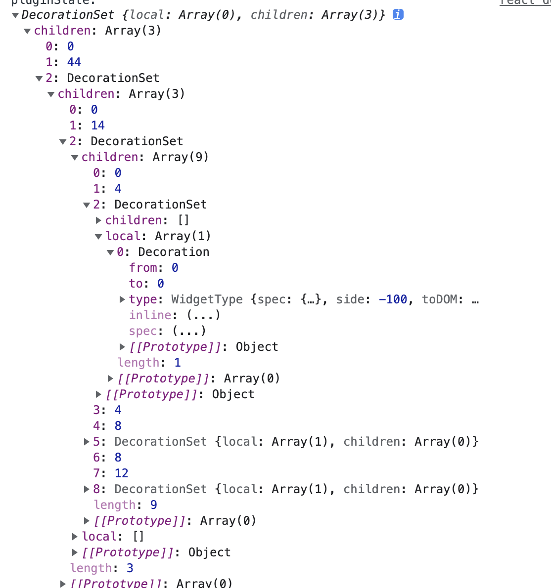

## Decorations 的功能

> Decorations make it possible to influence the way the document is drawn, without actually changing the document.

这里引用官网的话，`decoration`的功能就是影响`PmNode`如何绘制，却无需改变 prosemirror 内部`state.doc`的结构。prosemirror 的`customNodeView`也可以做到这一点，但是`customNodeView`更接近`PmNode`，`decoration`更像`PmMark`多一点。

## Decoration 和 DecorationSet 的数据结构

